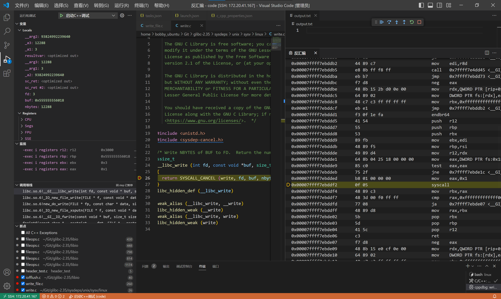

# fwrite()和fflush()

## FILE结构体

```c
char* _IO_read_ptr: 指向缓冲区中当前读取位置的指针
char* _IO_read_end: 指向缓冲区的末尾位置的指针
char* _IO_read_base: 指向缓冲区的起始位置的指针. 
char* _IO_write_base: 指向缓冲区的起始位置的指针. (写)
char* _IO_write_ptr: 指向缓冲区中当前写入位置的指针
char* _IO_write_end: 指向缓冲区的末尾位置的指针
char* _IO_buf_base: 指向缓冲区的起始位置的指针
char* _IO_buf_end: 指向缓冲区的末尾位置的指针
```

## fflush调用栈

> 缓冲区阈值:4096B

### 底层:`__GI___libc_write`

```c
syscall(1)
//1 common write   sys_write
```



### fflush()

- IO_fflush
    `int _IO_fflush (FILE *fp)`
    ```c
    // libio/iofflush.c中
    weak_alias (_IO_fflush, fflush)
    ```
- _IO_new_file_sync
    `int _IO_new_file_sync (FILE *fp)`
    - `if (fp->_IO_write_ptr > fp->_IO_write_base)`
        表示缓冲区中有待写入的数据, 进行_IO_new_do_write
        fp->_IO_write_ptr-fp->_IO_write_base==4095

        如果write已经写入了, 就不会走入这个分支, 之后就直接返回
- status=_IO_new_do_write
    `int _IO_new_do_write (FILE *fp, const char *data, size_t to_do)`
    data即数据, to_do==fp->_IO_write_ptr-fp->_IO_write_base==4095
    - `to_do==0`
        返回0
    - `todo!=0`
        执行new_do_write, 返回值为写入的byte数, 并与todo作比较
        - 如果相等, 说明写入完毕, 返回0
        - 否则返回EOF
- remain=new_do_write(fp,data,to_do)
    `static size_t new_do_write (FILE *fp, const char *data, size_t to_do)`
    返回值为写入的byte数
    `count = _IO_SYSWRITE (fp, data, to_do);`调用`_IO_new_file_write`

- remain=_IO_new_file_write(fp,data,n)
    返回写入byte数
    ```c
    int to_do=n;
    while (to_do > 0)
    {
        ssize_t count =__GI___libc_write (f->_fileno, data, to_do);
        to_do -= count;
        data = (void *) ((char *) data + count);
    }
    n -= to_do;
    return n;
    ```
- remain=__GI___libc_write()
    返回写入byte数

<!-- ```
bt
#0  __GI___libc_write (fd=3, buf=buf@entry=0x55555555a490, nbytes=nbytes@entry=4095) at ../sysdeps/unix/sysv/linux/write.c:26
#1  0x00007ffff7e49f1a in _IO_new_file_write (f=0x5555555592a0, data=0x55555555a490, n=4095) at fileops.c:1177
#2  0x00007ffff7e493da in new_do_write (fp=0x5555555592a0, data=0x55555555a490 '#' <repeats 200 times>..., to_do=to_do@entry=4095) at /home/bobby_ubuntu/Git/glibc-2.35/libio/libioP.h:947
#3  0x00007ffff7e4ac28 in _IO_new_do_write (fp=<optimized out>, data=<optimized out>, to_do=4095) at fileops.c:425
#4  0x00007ffff7e49000 in _IO_new_file_sync (fp=0x5555555592a0) at fileops.c:798
#5  0x00007ffff7e3ef2e in __GI__IO_fflush (fp=0x5555555592a0) at /home/bobby_ubuntu/Git/glibc-2.35/libio/libioP.h:947
#6  0x0000555555555243 in main () at /home/bobby_ubuntu/Git/code/write_file.c:18
``` -->

### fwrite()

- _IO_fwrite(buf,size,count,fp)
- written=_IO_new_file_xsputn(fp,data,to_do=n)
    关键函数, 返回写入的byte
    ```c
    /* This is an optimized implementation.
    If the amount to be written straddles a block boundary
    (or the filebuf is unbuffered), use sys_write directly. */
    /* First figure out how much space is available in the buffer. */
    ```
    `if ((f->_flags & _IO_LINE_BUF) && (f->_flags & _IO_CURRENTLY_PUTTING)){...}`
        - `_IO_LINE_BUF`:
            以行缓冲模式打开的, 当遇到换行符时, 缓冲区中的数据会被刷新到文件.
        - `_IO_CURRENTLY_PUTTING`:
            fp正在执行写操作.
        决定must_flush是否为1
    `else if (f->_IO_write_end > f->_IO_write_ptr){...}`
        执行`count = f->_IO_write_end - f->_IO_write_ptr;`, count为写缓冲区结尾-当前写指针, 即剩余缓冲区大小
    然后根据count大小判断是否填充缓冲区
    `if (to_do + must_flush > 0)`
        当to_do部位0或者must_flush=1时:
        这里首先会分配缓冲区(fp的缓冲区指针在这里初始化)
        调用_IO_new_file_overflow()
    ```c
    block_size = f->_IO_buf_end - f->_IO_buf_base;
    //当前要的缓冲区块大小, 默认为4096
    do_write = to_do - (block_size >= 128 ? to_do % block_size : 0);
    //小于128直接写入; 否则依据缓冲区大小分块写入
    //比如写入4097, do_write就是4096; 写入1GiB+1, do_write就是1GiB 

    if (do_write)
	{
        count = new_do_write (f, s, do_write);
        to_do -= count;
        if (count < do_write)
            return n - to_do;
	}

    //最后一块为to_do % block_size, 这里写入剩余部分
    //比如写入4097, todo就是1
    if (to_do)
        to_do -= _IO_default_xsputn (f, s+do_write, to_do);
    ```
- _IO_new_do_write
- _IO_new_file_write
- __GI___libc_write
    同上

### 大文件写入

```c
// #define SIZE (2*4*KiB+1)
// 8192         8*KiB
// 1

// #define SIZE (1*MiB-1)
// 1044480      1*MiB-1*KiB
// 4095         1*KiB-1

// #define SIZE (1*GiB)
// 1073741824   1*Gib

// #define SIZE (1*GiB+2*MiB+(1*MiB-1))
// 1076883456   1*GiB+(3*MiB-1*KiB)
// 4095         1*KiB-1

// #define SIZE (1*GiB+2*MiB+3*KiB+4)
// 1075838976   1*GiB+2*MiB
// 3076         3*KiB-4

// #define SIZE __UINT32_MAX__
// __UINT32_MAX__==4294967295 4*GiB-1
// 提交                         实际
// 4294963200   4*GiB-4*KiB     2147479552(7FFFF000)   这里系统调用没有写完, 只写了约2G
// 2147483648   2*GiB           2147479552(7FFFF000)
// 4096         4*KiB           4096
// 4095         4*KiB-1         4096

// #define SIZE (2*GiB+1*MiB)
// #define SIZE 2148532224
// 提交                 实际
// 2148532224(80100000) 2147479552(7FFFF000)   
// 1052672(101000)      1052672(101000)
```

### 多次写入

```c
#define SIZE (2*4*KiB+1)
// 8192
// 4096
// 4096
// 2
// 两次fwrite
```


<!-- ```
#0  __GI___libc_write (fd=3, buf=buf@entry=0x555555559480, nbytes=nbytes@entry=4096) at ../sysdeps/unix/sysv/linux/write.c:26
#1  0x00007ffff7e49f1a in _IO_new_file_write (f=0x5555555592a0, data=0x555555559480, n=4096) at fileops.c:1177
#2  0x00007ffff7e493da in new_do_write (fp=fp@entry=0x5555555592a0, data=data@entry=0x555555559480 '#' <repeats 200 times>..., to_do=to_do@entry=4096) at /home/bobby_ubuntu/Git/glibc-2.35/libio/libioP.h:947
#3  0x00007ffff7e4a0f3 in _IO_new_file_xsputn (f=0x5555555592a0, data=<optimized out>, n=4096) at fileops.c:1254
#4  0x00007ffff7e3fe21 in __GI__IO_fwrite (buf=0x555555559480, size=1, count=4096, fp=0x5555555592a0) at /home/bobby_ubuntu/Git/glibc-2.35/libio/libioP.h:947
#5  0x000055555555523b in main () at /home/bobby_ubuntu/Git/code/write_file.c:17
``` -->
