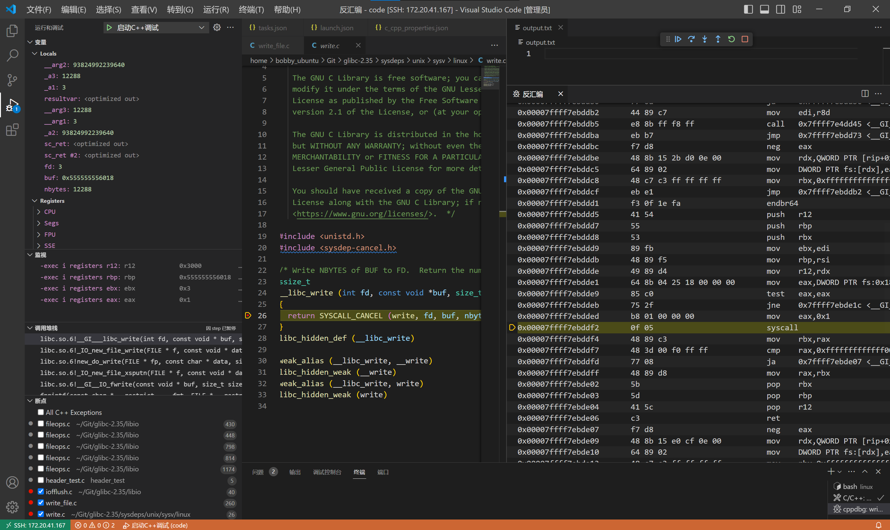

# fwrite()和fwrite()

## FILE结构体

```c
char* _IO_read_ptr: 指向缓冲区中当前读取位置的指针
char* _IO_read_end: 指向缓冲区的末尾位置的指针
char* _IO_read_base: 指向缓冲区的起始位置的指针. 
char* _IO_write_base: 指向缓冲区的起始位置的指针. (写)
char* _IO_write_ptr: 指向缓冲区中当前写入位置的指针
char* _IO_write_end: 指向缓冲区的末尾位置的指针
char* _IO_buf_base: 指向缓冲区的起始位置的指针
char* _IO_buf_end: 指向缓冲区的末尾位置的指针
size_t _IO_buf_size: 缓冲区的大小. 
```

## fflush调用栈

> 缓冲区阈值,比如:4096B

### 底层:`__GI___libc_write`

```c
syscall(1)
//1 common write   sys_write
```



### SIZE=4095

使用fflush()写入

- __GI__IO_fflush
    `int _IO_fflush (FILE *fp)`
    ```c
    // libio/iofflush.c中
    weak_alias (_IO_fflush, fflush)
    ```
- _IO_new_file_sync
    `int _IO_new_file_sync (FILE *fp)`
    - `if (fp->_IO_write_ptr > fp->_IO_write_base)`
        表示缓冲区中有待写入的数据, 进行_IO_new_do_write
- _IO_new_do_write
    `int _IO_new_do_write (FILE *fp, const char *data, size_t to_do)`
    - `to_do==0`
        返回0
    - `todo!=0`
        执行new_do_write, 返回值为写入的byte数, 并与todo作比较
        - 如果相等, 说明写入完毕, 返回0
        - 否则返回EOF
- new_do_write
    `static size_t new_do_write (FILE *fp, const char *data, size_t to_do)`
- _IO_new_file_write
- __GI___libc_write
    以上三个都是返回写入byte数

```
bt
#0  __GI___libc_write (fd=3, buf=buf@entry=0x55555555a490, nbytes=nbytes@entry=4095) at ../sysdeps/unix/sysv/linux/write.c:26
#1  0x00007ffff7e49f1a in _IO_new_file_write (f=0x5555555592a0, data=0x55555555a490, n=4095) at fileops.c:1177
#2  0x00007ffff7e493da in new_do_write (fp=0x5555555592a0, data=0x55555555a490 '#' <repeats 200 times>..., to_do=to_do@entry=4095) at /home/bobby_ubuntu/Git/glibc-2.35/libio/libioP.h:947
#3  0x00007ffff7e4ac28 in _IO_new_do_write (fp=<optimized out>, data=<optimized out>, to_do=4095) at fileops.c:425
#4  0x00007ffff7e49000 in _IO_new_file_sync (fp=0x5555555592a0) at fileops.c:798
#5  0x00007ffff7e3ef2e in __GI__IO_fflush (fp=0x5555555592a0) at /home/bobby_ubuntu/Git/glibc-2.35/libio/libioP.h:947
#6  0x0000555555555243 in main () at /home/bobby_ubuntu/Git/code/write_file.c:18
```

### SIZE=4096

在fwrite()中写入

- __GI__IO_fwrite
- _IO_new_file_xsputn
- new_do_write
- _IO_new_file_write
- __GI___libc_write

```
#0  __GI___libc_write (fd=3, buf=buf@entry=0x555555559480, nbytes=nbytes@entry=4096) at ../sysdeps/unix/sysv/linux/write.c:26
#1  0x00007ffff7e49f1a in _IO_new_file_write (f=0x5555555592a0, data=0x555555559480, n=4096) at fileops.c:1177
#2  0x00007ffff7e493da in new_do_write (fp=fp@entry=0x5555555592a0, data=data@entry=0x555555559480 '#' <repeats 200 times>..., to_do=to_do@entry=4096) at /home/bobby_ubuntu/Git/glibc-2.35/libio/libioP.h:947
#3  0x00007ffff7e4a0f3 in _IO_new_file_xsputn (f=0x5555555592a0, data=<optimized out>, n=4096) at fileops.c:1254
#4  0x00007ffff7e3fe21 in __GI__IO_fwrite (buf=0x555555559480, size=1, count=4096, fp=0x5555555592a0) at /home/bobby_ubuntu/Git/glibc-2.35/libio/libioP.h:947
#5  0x000055555555523b in main () at /home/bobby_ubuntu/Git/code/write_file.c:17
```
